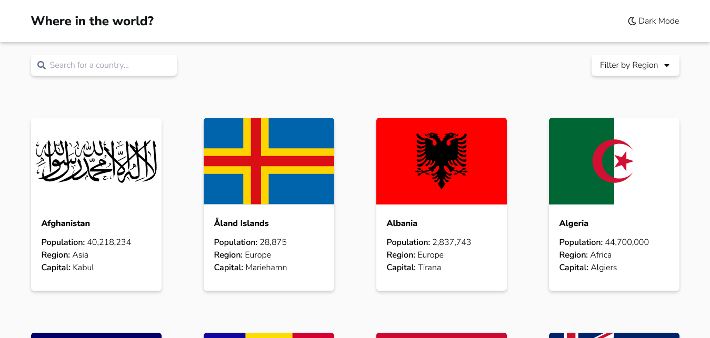
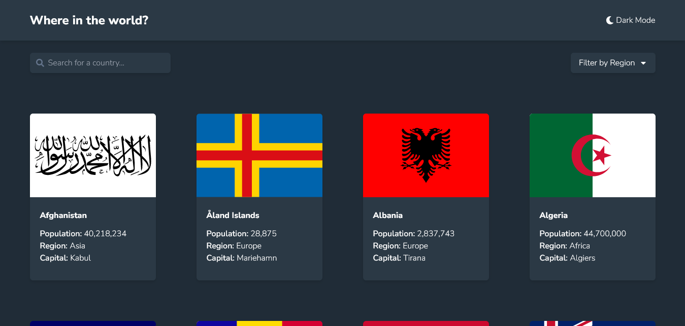

# Frontend Mentor - REST Countries API with color theme switcher solution

This is a solution to the [REST Countries API with color theme switcher challenge on Frontend Mentor](https://www.frontendmentor.io/challenges/rest-countries-api-with-color-theme-switcher-5cacc469fec04111f7b848ca). Frontend Mentor challenges help you improve your coding skills by building realistic projects.

## Table of contents

- [Overview](#overview)
  - [The challenge](#the-challenge)
  - [Screenshot](#screenshot)
  - [Links](#links)
- [My process](#my-process)

  - [Built with](#built-with)
  - [What I learned](#what-i-learned)
  - [Useful resources](#useful-resources)

- [Author](#author)

## Overview

### The challenge

Users should be able to:

- See all countries from the API on the homepage
- Search for a country using an `input` field
- Filter countries by region
- Click on a country to see more detailed information on a separate page
- Click through to the border countries on the detail page
- Toggle the color scheme between light and dark mode _(optional)_

### Screenshot

### Links

- [Live Site](https://mwiafeansong.github.io/countries-app/)

## My process

### Built with

- Vite
- Tailwind

### What I learned

- Theme switching in react
- How to filter items based on input text
- Using dark mode with tailwind
- PropTypes

### Useful resources

- [Tailwind Dark Mode](https://tailwindcss.com/docs/dark-mode) - This helped me create dark mode with tailwind

## Author

- Frontend Mentor - [@mwiafeansong](https://www.frontendmentor.io/profile/mwiafeansong)
